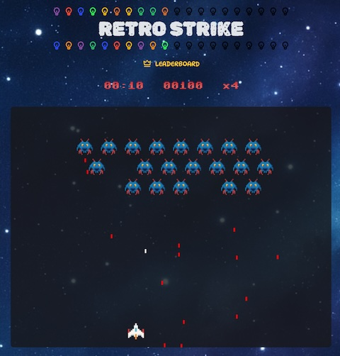

# Retro Strike

Retro Strike is a classic-style arcade shooter game project. Blast through waves of enemies, collect power-ups, and aim for the highest score in this retro-inspired adventure.

Play online: [https://retro-strike.jingwood.me](https://retro-strike.jingwood.me)

# Development 

This game was developed using Nuxt, Vue, and Canvas2D.

You can clone the repository, run `yarn`, and then `yarn dev` to build and run it locally. 

Feel free to share your suggestions or create your own version!

